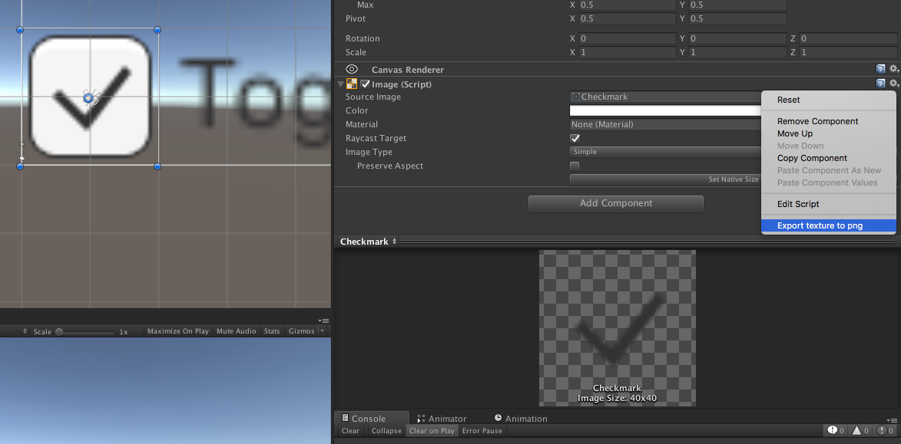

# Texture Exporter

Export procedural or hidden textures to .png files with one click!

## Use case

Say you want to have a red check mark instead of the default black one. If your photoshop skills aren't up to the task or you don't want to waste time, just export the default checkmark texture, color it with your favorite image manipulation software and _voilá_.

## Instructions

1. Import the `Packages/TextureExporter.unitypackage`
2. Click the gear icon on any SpriteRenderer/Image/RawImage/MeshRenderer
3. Click "Export texture to png"

